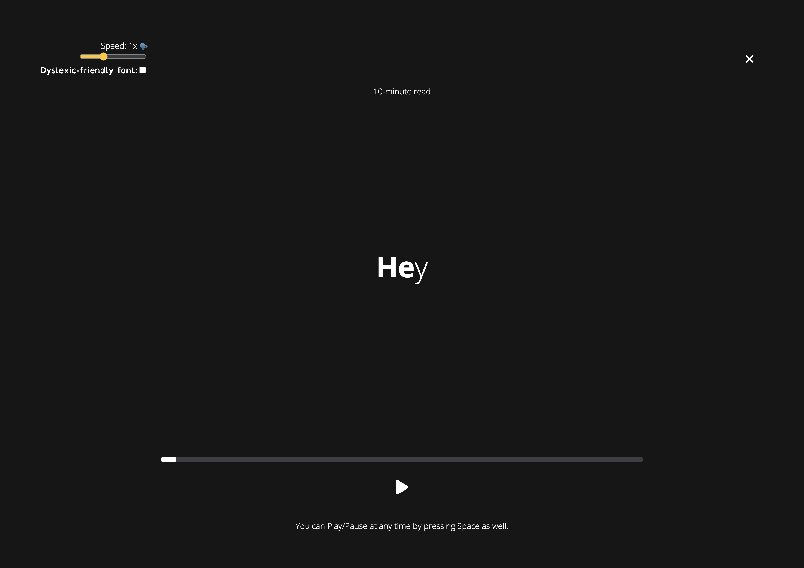

# Spritz🍹 - Your Speedreading Companion

You can try out Spritz at this [link](https://spritz.parsuli.net).

## What is it?

Spritz is a simple web app that takes in a document (PDF or plaintext), and helps you read it fast. Words are flashed at you at a custom rate, and read out loud using TTS to help with information retention. The text is also styled according to the [Bionic Reading](https://bionic-reading.com/br-method/) method to further assist with reading words quickly.

Given that the aim is to facilitate reading, Spritz also comes with the Open Dyslexic font in case Open Sans is problematic.

## Why was this made?

This was our hackathon submission to *[The Dons Hack 2023](https://usf-wit.github.io/THE-DONS-HACK/)* at the University of San Francisco. Spritz won the prize for *Best Website*.

We made Spritz because reading boring things is boring, and sometimes we have to read boring things. We don't like boring things, so we made Spritz to make a boring thing less boring.

## Who made this?
* [@JacksonCrawford](https://github.com/JacksonCrawford)
* [@par5ul1](https://github.com/par5ul1) (also the author of this README)

## License?
GPL-3.0...?

Literally do whatever you want with the source code — just don't sell it. Spritz is free. It's an educational project. It doesn't have to be a product.
